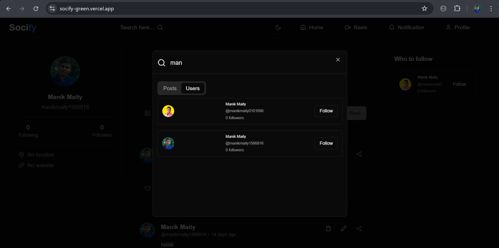

# 📸 Socify - A Social Media App  

**Socify** is a modern social media application inspired by **Instagram**, built using **Next.js**. Users can create posts and reels, tag people, search for users and posts, like, comment, share, and interact with each other. The app supports real-time notifications, infinite scrolling for reels, dark/light mode, and a fully responsive design.

## 🚀 Features  

- User authentication (Clerk)  
- Create, edit, delete, and share posts & reels  
- Tag users in posts  
- Like, comment, and copy post links  
- Follow/unfollow users  
- Search for posts and users  
- Real-time notifications for interactions  
- Infinite scrolling for reels  
- Profile page with edit functionality  
- Responsive design with dark/light mode  

## 📡 Live Website

You can access the live version of **Socify** at [https://socify-green.vercel.app](https://socify-green.vercel.app).

## 🛠 Tech Stack  

- **Frontend:** `Next.js`,`React`, `TypeScript`, `ShadCN`, `TailwindCSS`, `UploadThing`, `React-Toastify`  
- **Backend:** `Next.js Server Actions`, `Prisma`, `PostgreSQL`  
- **Authentication:** `Clerk`  

## 📷 Image Previews


## 📌 Installation  

#### Home


#### Search


#### Profile


#### Reel


#### Notifications


### **Prerequisites**  
- Node.js installed  
- PostgreSQL database set up  

### **Steps**  

#### 1️⃣ Clone the Repository  
```bash
git clone https://github.com/ManikMaity/socify.git
cd socify
```

#### 2️⃣ Install Dependencies
```bash
npm install
```

#### 3️⃣ Create Environment Variables
- Create a `.env` file in the root directory and add the following environment variables:
```
NEXT_PUBLIC_CLERK_PUBLISHABLE_KEY="your-public-key"
CLERK_SECRET_KEY="your-secret-key"
DATABASE_URL="your-database-url"
UPLOADTHING_TOKEN="your-uploadthing-token"
```

#### 4️⃣ Run the App
```bash
npm run dev
```
- You should now be able to access the app at `http://localhost:3000`
